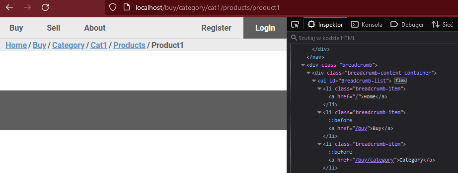

# Zadanie rekrutacyjne

## Wdrożenie budowania nawigacji okruszkowej

Do wykonania wykorzystano plik .htaccess, by za pomocą protokołu **404** przekierowywać użytkownika do pliku strony domyślnej.

Kod w [pliku Javascript](./scripts/script.js?plain=1#L11) konwertuje adresy podstron na osobne elementy, które po przetworzeniu dodawane są do DOMu w wymaganej w założeniach formie (odnośniki do podstron wyższego poziomu, aktualna strona wyświetlona w formie nieklikalnej).

</img>

Z uwagi na użycie pliku konfiguracyjnego .htaccess zadanie należy otworzyć na serwerze lokalnym Apache.
